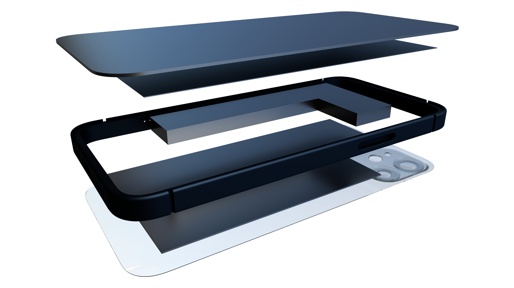

# iPhone13MiniCoolingCase
This repository contains the mechanical design of the iPhone 13 Mini case with an embedded heatsink for improving phone performance.

## Heatsink Development

### Overview
The project explores various heatsink designs to enhance heat dissipation and optimize phone performance. Key considerations include:
- **Thermal dissipation target**: 5W
- **Model limitations**: The CPU is not the sole heating element.
- **Design diversity**: Aesthetic and performance-focused variations.

### Studies and Results

#### Study 1: Bare iPhone Thermal Performance
*Baseline performance without a heatsink. Used to establish a reference for subsequent tests.*

#### Study 2: Simple 4mm Thick Heatsink (Circular Patterns)
*Testing heat dissipation using simple circular elements of 4mm thickness.*

#### Study 3: Squares Instead of Circles
*Evaluating the thermal performance of square patterns in place of circles.*

#### Study 4: Triangles (Pyramid Shapes)
*Exploring triangular pyramid elements to increase heat conduction.*

#### Study 5: Lines (Air Channels)
*Incorporating linear air channels to improve airflow and thermal dissipation.*

#### Study 6: Air Channels in Circular Patterns
*Testing a circular arrangement with a thicker element placed at the most heat-generative spot.*

#### Study 7: Squares with Thicker Heat Conducting Elements
*Increasing the thickness of square elements to enhance heat conduction from hotspots.*

#### Study 8: Increased Surface Area
*Maximizing the surface area to improve thermal dissipation.*

#### Study 9: 2mm Thick Heatsink
*Assessing the impact of reducing heatsink thickness to 2mm on performance.*

#### Study 10: Combination of 4mm Squares and Air Channels
*Combining 4mm thick square patterns on top with air channels underneath.*

#### Study 11: Simulation with Slight Airflow
*Introducing slight airflow in the simulation to evaluate its effect on heat dissipation.*

#### Study 12: Circles on Both Sides (4mm Thick)
*Testing 4mm thick circular patterns applied to both sides of the heatsink.*

#### Study 13: Circles (2mm Thick)
*Reducing the thickness of circular patterns to 2mm and evaluating performance.*

#### Study 14: 5mm Diameter Circles (3mm Thick)
*Testing larger circles with a diameter of 5mm and thickness of 3mm.*

#### Study 15: Circles with Air Channels Along Long Edge
*Integrating air channels aligned along the long edge while retaining circular patterns.*

#### Study 16: Solid Element Along Long Edge
*Adding a continuous solid element along the long edge to improve heat conduction.*

#### Study 17: Circles with Semi-Solid Central Element
*Combining circular patterns with partial solid regions near the heat source.*

#### Study 18: Circles with Solid Element Above Heat Spot
*Focusing solid regions directly over the heat spot while retaining circular patterns elsewhere.*

#### Study 19: Enlarged Solid Element with Pattern
*Expanding the solid element while maintaining a patterned design for heat conduction.*

#### Study 20: Full Case Design Simulation
*Simulating the heatsink integrated into the complete case design to evaluate overall performance.*

## Additional Resources
### Design Renders

#### Aluminium Heatsink

#### Copper Heatsink

### Simulation Models

### Analysis Results

### First Attempts

