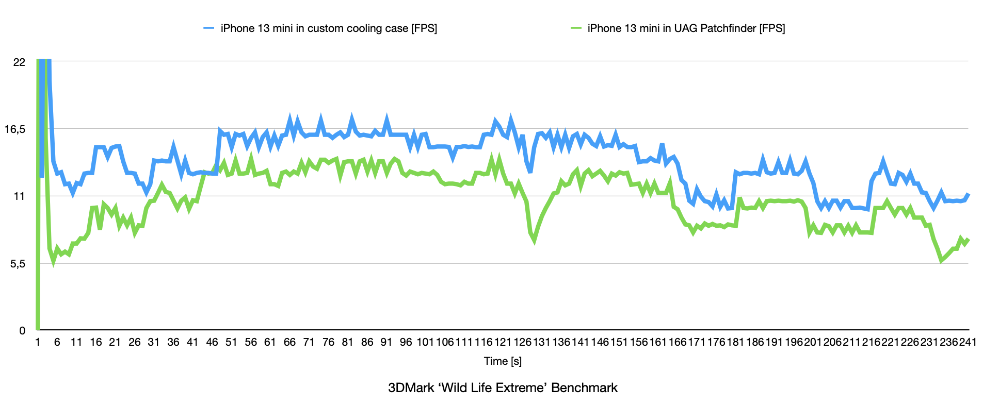

# iPhone13MiniCoolingCase
This repository contains the mechanical design of the iPhone 13 Mini case with an embedded heatsink for improving phone performance.

## Heatsink Development

### Intro

While using my iPhone 13 mini, I’ve experienced several situations where the phone overheated to the point of being unusable. The most demanding scenario is while driving, which can be especially frustrating. I typically use navigation in the foreground at maximum screen brightness, stream music in the background, keep the personal hotspot turned on, and often have a drained battery. When the phone becomes too hot, Google Maps starts to lag, the battery stops charging, or it may even discharge slowly.

My worst experience occurred during a vacation in Malta, where temperatures were well over 35°C and the phone was in direct sunlight. I ended up with a completely dead battery and resorted to placing the phone in a grocery store’s fridge to cool it down enough so I could charge it and find my way back to the hotel.

### Overview
The general idea was to design a passively cooled iPhone case no thicker than my current one (a UAG Pathfinder). I used Fusion 360 for the design simulations. Since no specific information about the internal design of the iPhone 13 mini such as materials used or the TDP of heat-generating components is readily available online, I had to make certain assumptions.
- **Thermal dissipation target**: 5W
- **Model limitations**: The CPU is not the sole heating element - assume the whole PCB will distribute the heat equally from all components.
- **Design diversity**: Aesthetic and performance-focused variations.

### First Attempts of modelling iPhone

With choosen materials - glass for front and back - the simulation gave unrealistic results. The first model of the phone was too simple.

### More detailed model of the iPhone

Analyzed phone disassembly on iFixit site. Added to the model thin stainless steel sheets. With this change the simulations seems to be much more realistic. 

Verified design with themal camera (at IDLE) and the thermal distirubtion looks similar. 

### Studies and Results

Started iterating with the design to find design which will look nice, dissipate heat effectively and will be relatively easy to produce.

#### Study 1: Bare iPhone Thermal Performance
*Baseline performance without a heatsink. Used to establish a reference for subsequent tests.*

#### Study 2: Simple 4mm Thick Heatsink (Circular Patterns)
*Testing heat dissipation using simple circular elements of 4mm thickness.*

#### Study 3: Squares Instead of Circles
*Evaluating the thermal performance of square patterns in place of circles.*

#### Study 4: Triangles (Pyramid Shapes)
*Exploring triangular pyramid elements to increase heat conduction.*

#### Study 5: Lines (Air Channels)
*Incorporating linear air channels to improve airflow and thermal dissipation.*

#### Study 6: Air Channels in Circular Patterns
*Testing a circular arrangement with a thicker element placed at the most heat-generative spot.*

#### Study 7: Squares with Thicker Heat Conducting Elements
*Increasing the thickness of square elements to enhance heat conduction from hotspots.*

#### Study 8: Increased Surface Area
*Maximizing the surface area to improve thermal dissipation.*

#### Study 9: 2mm Thick Heatsink
*Assessing the impact of reducing heatsink thickness to 2mm on performance.*

#### Study 10: Combination of 4mm Squares and Air Channels
*Combining 4mm thick square patterns on top with air channels underneath.*

#### Study 11: Simulation with Slight Airflow
*Introducing slight airflow in the simulation to evaluate its effect on heat dissipation.*

#### Study 12: Circles on Both Sides (4mm Thick)
*Testing 4mm thick circular patterns applied to both sides of the heatsink.*

#### Study 13: Circles (2mm Thick)
*Reducing the thickness of circular patterns to 2mm and evaluating performance.*

#### Study 14: 5mm Diameter Circles (3mm Thick)
*Testing larger circles with a diameter of 5mm and thickness of 3mm.*

#### Study 15: Circles with Air Channels Along Long Edge
*Integrating air channels aligned along the long edge while retaining circular patterns.*

#### Study 16: Solid Element Along Long Edge
*Adding a continuous solid element along the long edge to improve heat conduction.*

#### Study 17: Circles with Semi-Solid Central Element
*Combining circular patterns with partial solid regions near the heat source.*

#### Study 18: Circles with Solid Element Above Heat Spot
*Focusing solid regions directly over the heat spot while retaining circular patterns elsewhere.*

#### Study 19: Enlarged Solid Element with Pattern
*Expanding the solid element while maintaining a patterned design for heat conduction.*

#### Study 20: Full Case Design Simulation
*Simulating the heatsink integrated into the complete case design to evaluate overall performance.*

## Casing design
After finding the best heatsink design - designed 3d printable flexible case. 

### Results of producibility analysis

### Manufacturing

**Heatsink**
- CNC file: aluminium_heatsink_rev14 v11.step
- Material: Aluminum 6061
- Surface Finish: Bead blasting + Anodizing-Black-Matte
- Tightest Tolerance: ISO 2768 medium
- Smallest Roughness	Ra3.2

**Flexible casing**
- 3D file: iPhone13mini-heatsink-case.step
- material: TPU

## Assembly

## Testing

To evaluate the designed enclosure, a series of tests were performed, simulating behavior close to the problematic scenario.

## Charge up time
For both tests used the same unit of iPhone 13 mini, battery health status reported by the OS is 85%, placed in the same position, charged from 0% with Apple 35W charger, constant ambient temperature (23 deg Celsius), maximum screen brightness set to 100% and screen recording on during duration of the experiment:
-  with UAG Pathfinder case: 3:37
- with custom cooling case: 1:50

## Series of benchmarks

First classification done in Geekbench:
- CPU score with UAG Pathfinder case: 5007
- CPU score with custom cooling case: 5240

- GPU score with UAG Pathfinder case: 18343
- GPU score with custom cooling case: 18633

For more extensive tests used much longer lasting AntutBenchmark, run 3 times one after another, for both cases with 35W charger plugged in and starting from exactly 50% charge:
- scores with UAG Pathfinder case: 946059, 955758, 926747
- scores with custom cooling case: 854717, 851384, 888220 (battery reached 80% charge)

Used also 3DMark aplication which generate GPU intensive load and return data in JSON format:

## Conclusions

Overall, I would consider the time spent on this casing well worth it. The improvement might not be clearly visible in benchmarks, but it’s definitely noticeable when holding the phone or switching to another application under load. It also helped eliminate the “Charging On Hold” notification. And, of course, I now own the most overengineered phone case among my colleagues!
